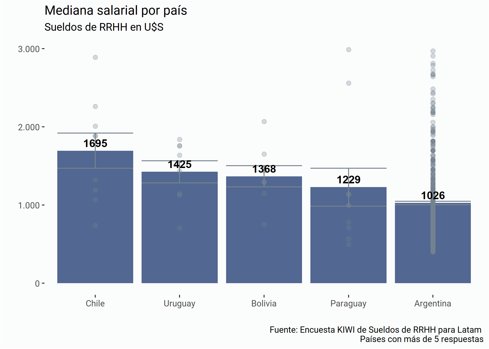
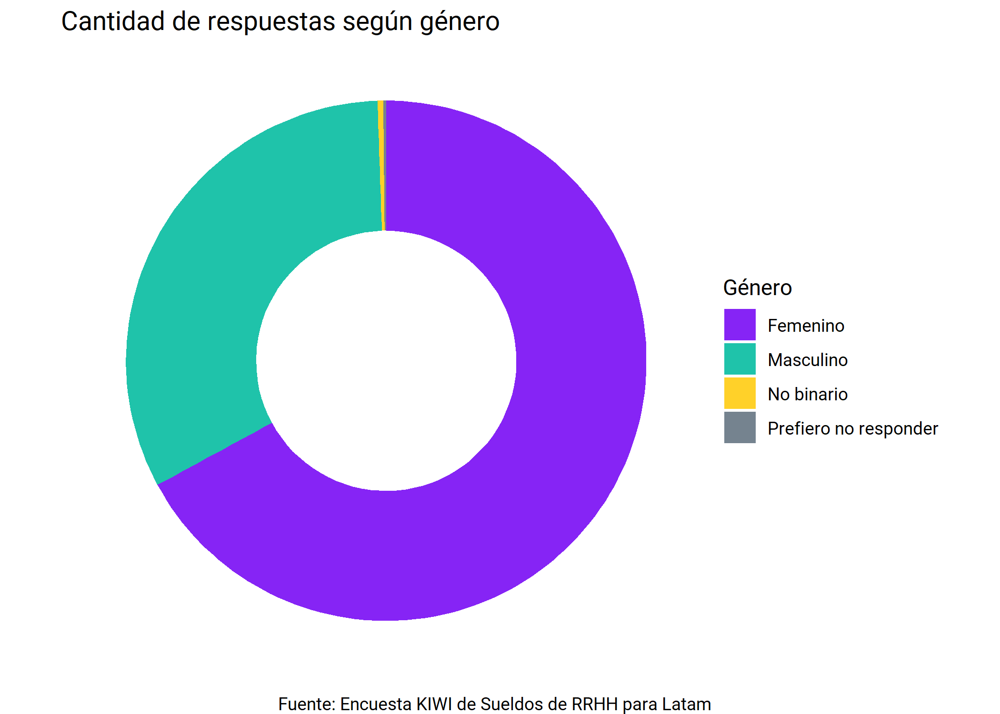
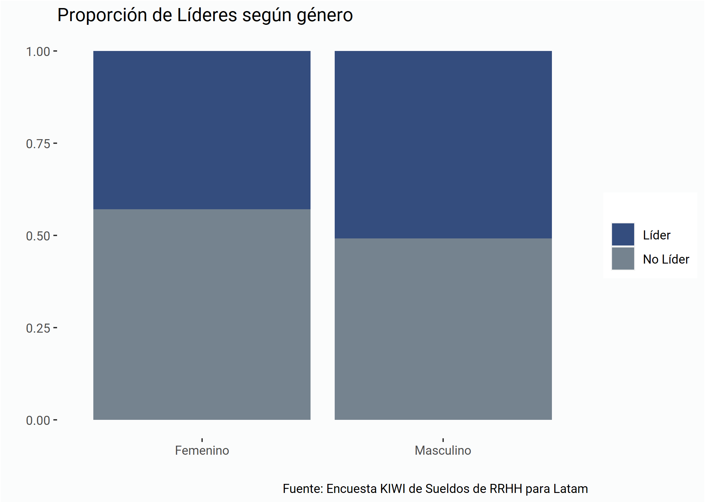

Respuestas Parciales
================

# Quiénes somos

El [Club de R para RRHH](https://r4hr.club) es una comunidad de
aprendizaje de programación en R destinada para las personas que
trabajan en Recursos Humanos en países de habla hispana.

Nuestro objetivo es acercar el mundo de ciencias de datos a nuestra
profesión, adaptando el contenido a nuestros skills y conocimientos, y
también siempre que podemos, usando datos relacionados con la gestión de
personas, y en castellano, para hacer más accesible el aprendizaje.

Este es un proyecto que ideó [Sergio García
Mora](https://www.linkedin.com/in/sergiogarciamora/), y que reúne a
gente de Argentina, Perú, Chile, Paraguay, Uruguay, Panamá, USA,
Francia, y cada vez más y más profesionales de distintas latitudes se
unen y contribuyen al proyecto.

Para más información sobre el Club de R leé [este
post](https://r4hr.club/2020/09/23/el-club-de-r-para-rrhh/), o
escribinos a <info@r4hr.club>.

## La encuesta KIWI 🥝 de Sueldos de RRHH para LATAM

Uno de los problemas en el aprendizaje de People Analytics es la falta
de datasets para practicar, así que una decisión que tomamos fue el de
generar nuestro propio dataset y de abrirlo para toda la comunidad.

Para hacer esta encuesta nos “inspiramos” en
[SysArmy](https://sysarmy.com/blog/), una comunidad para las personas
que trabajan en tecnología que además de organizar uno de los eventos
más importantes de tecnología de Argentina, Nerdearla, y también
organizan una encuesta salarial dos veces por año.

Estas son las motivaciones detrás de esta encuesta. Tener nuestro propio
dataset, compartir los resultados y los datos, para que todos los
entusiastas de RRHH y los datos cuenten con una fuente de datos para
practicar.

> Si querés conocer la historia detrás del nombre de la encuesta, la
> podés [conocer aquí](https://r4hr.club/why-kiwi/).

## Organizadores

🕵 [Adrián Quiroga](https://www.linkedin.com/in/adrian-quiroga-ab57424b/)

👩‍💻 [Alithu Castro](https://www.linkedin.com/in/alithucastro/)

👩‍🎓 [Andrea Herpsomer](https://www.linkedin.com/in/andreaherpsomer/)

👩‍🎨 [Carla Cirone](https://www.linkedin.com/in/carla-cirone-0566b095/)

👩‍💻 [Daniela
García](https://www.linkedin.com/in/claudia-daniela-garcia-138b1a14b/)

👩‍🚀 [Lucía Huilén
Gómez](https://www.linkedin.com/in/luc%C3%ADa-huil%C3%A9n-g%C3%B3mez-93565276/)

👨‍🎤 [Santiago Lardone
Quinodoz](https://www.linkedin.com/in/santiago-lardone-quinodoz-978588167/)

🐍 [Sebastián
Lombraña](https://www.linkedin.com/in/santiago-lardone-quinodoz-978588167/)

🤘 [Sergio García Mora](https://www.linkedin.com/in/sergiogarciamora/)

👩‍🏫 [Yanel Paulette](https://www.linkedin.com/in/yanelpaulette/)

# Respuestas parciales

El 12 de noviembre publicamos los resultados finales.

# Participación

## Respuestas por países

<!--html_preserve-->

<table class="gt_table">

<thead class="gt_header">

<tr>

<th colspan="2" class="gt_heading gt_title gt_font_normal" style>

Cantidad de respuestas por país

</th>

</tr>

<tr>

<th colspan="2" class="gt_heading gt_subtitle gt_font_normal gt_bottom_border" style>

Países con más de 5 respuestas

</th>

</tr>

</thead>

<thead class="gt_col_headings">

<tr>

<th class="gt_col_heading gt_columns_bottom_border gt_left" rowspan="1" colspan="1">

País en el que trabajas

</th>

<th class="gt_col_heading gt_columns_bottom_border gt_right" rowspan="1" colspan="1">

Cuenta

</th>

</tr>

</thead>

<tbody class="gt_table_body">

<tr>

<td class="gt_row gt_left">

Argentina

</td>

<td class="gt_row gt_right">

572

</td>

</tr>

<tr>

<td class="gt_row gt_left">

Bolivia

</td>

<td class="gt_row gt_right">

12

</td>

</tr>

<tr>

<td class="gt_row gt_left">

Chile

</td>

<td class="gt_row gt_right">

12

</td>

</tr>

<tr>

<td class="gt_row gt_left">

Paraguay

</td>

<td class="gt_row gt_right">

12

</td>

</tr>

<tr>

<td class="gt_row gt_left">

México

</td>

<td class="gt_row gt_right">

8

</td>

</tr>

<tr>

<td class="gt_row gt_left">

Uruguay

</td>

<td class="gt_row gt_right">

8

</td>

</tr>

<tr>

<td class="gt_row gt_left">

Perú

</td>

<td class="gt_row gt_right">

5

</td>

</tr>

</tbody>

</table>

<!--/html_preserve-->

Recibimos un total de 641 respuestas 🎉:trophy:.

# Comparación de sueldos de RRHH por países

<!-- -->

**Aclaraciones:**

1.  Los resultados no son representativos dada la baja cantidad de
    respuestas (cada punto representa una respuesta).
2.  Para la comparación de los sueldos en dólares estadounidenses
    tomamos el tipo de cambio de cada país al 19 de octubre de 2020
    publicados por los respectivos bancos centrales.
3.  Sólo mostramos resultados de los países con al menos 5 respuestas.
4.  Podamos los sueldos para mostrar aquellos que están dentro de los
    percentiles 5 y 95.

# Representación de mujeres en puestos de liderazgo

## Participación según género

<!--html_preserve-->

<table class="gt_table">

<thead class="gt_header">

<tr>

<th colspan="3" class="gt_heading gt_title gt_font_normal" style>

Cantidad de respuestas según género

</th>

</tr>

<tr>

<th colspan="3" class="gt_heading gt_subtitle gt_font_normal gt_bottom_border" style>

</th>

</tr>

</thead>

<thead class="gt_col_headings">

<tr>

<th class="gt_col_heading gt_columns_bottom_border gt_center" rowspan="1" colspan="1">

Género

</th>

<th class="gt_col_heading gt_columns_bottom_border gt_center" rowspan="1" colspan="1">

Cantidad

</th>

<th class="gt_col_heading gt_columns_bottom_border gt_center" rowspan="1" colspan="1">

Porcentaje

</th>

</tr>

</thead>

<tbody class="gt_table_body">

<tr>

<td class="gt_row gt_center">

Femenino

</td>

<td class="gt_row gt_center">

380

</td>

<td class="gt_row gt_center">

66.9%

</td>

</tr>

<tr>

<td class="gt_row gt_center">

Masculino

</td>

<td class="gt_row gt_center">

185

</td>

<td class="gt_row gt_center">

32.6%

</td>

</tr>

<tr>

<td class="gt_row gt_center">

No binario

</td>

<td class="gt_row gt_center">

2

</td>

<td class="gt_row gt_center">

0.4%

</td>

</tr>

<tr>

<td class="gt_row gt_center">

Prefiero no responder

</td>

<td class="gt_row gt_center">

1

</td>

<td class="gt_row gt_center">

0.2%

</td>

</tr>

</tbody>

<tfoot class="gt_sourcenotes">

<tr>

<td class="gt_sourcenote" colspan="3">

Fuente: Encuesta KIWI de Sueldos de RRHH para Latam

</td>

</tr>

</tfoot>

</table>

<!--/html_preserve-->

## Participación según género

De acuerdo a las respuestas recolectadas **2 de cada 3** participantes
son mujeres.

Para los puestos de liderazgo consideramos las personas en los puestos
de *Director, Gerente, Jefe, Responsable,* y *Supervisor*.

Del total de mujeres, 380 respuestas, 163 ocupan un puesto de liderazgo
(42.9%).

Del total de hombres, 185 respuestas, 94 ocupan un puesto de liderazgo
(50.8%).

<!-- -->
