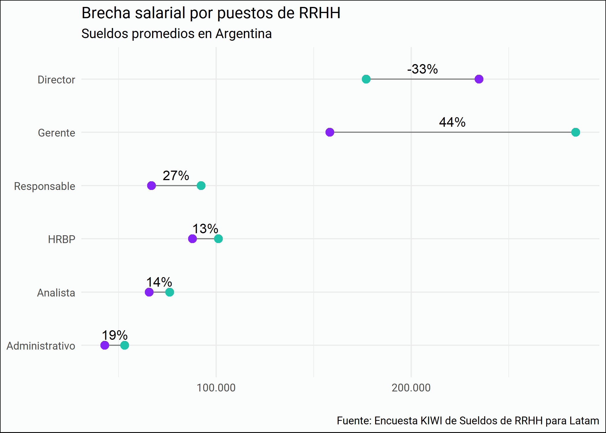
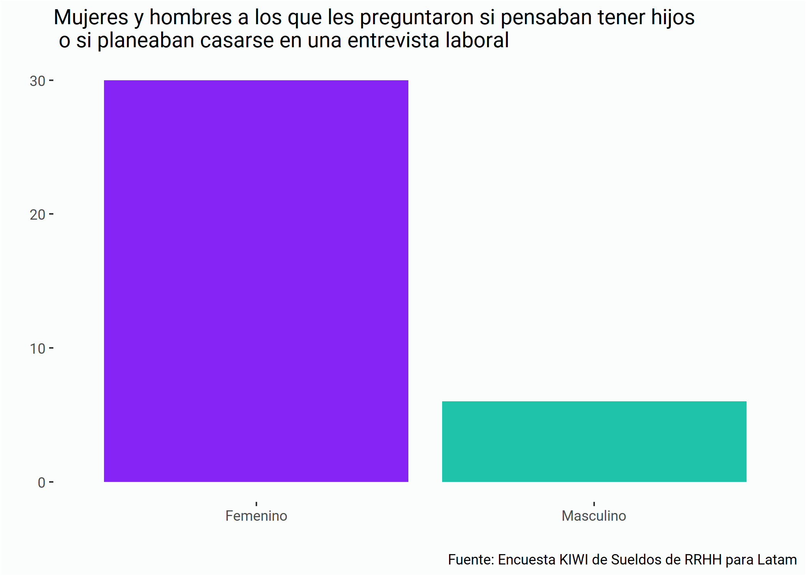
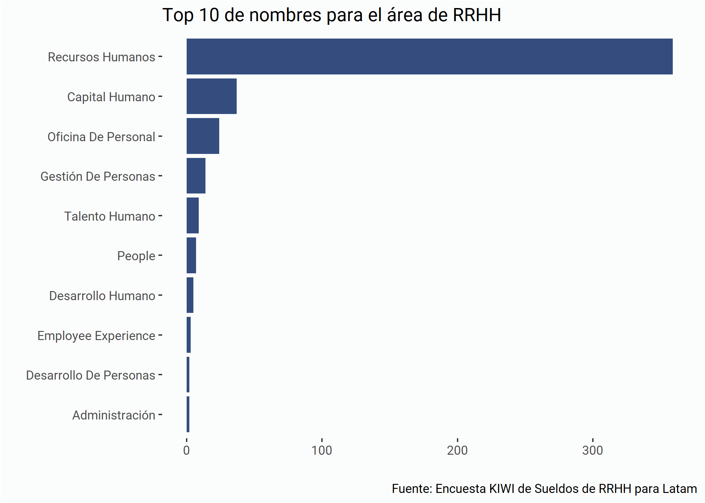

Respuestas Parciales Encuesta KIWI de Sueldos de RRHH de LATAM
================

# Quiénes somos

El [Club de R para RRHH](https://r4hr.club) es una comunidad de
aprendizaje de programación en R destinada para las personas que
trabajan en Recursos Humanos en países de habla hispana.

Nuestro objetivo es acercar el mundo de ciencias de datos a nuestra
profesión, adaptando el contenido a nuestros skills y conocimientos, y
también siempre que podemos, usando datos relacionados con la gestión de
personas, y en castellano, para hacer más accesible el aprendizaje.

Este es un proyecto que ideó [Sergio García
Mora](https://www.linkedin.com/in/sergiogarciamora/), y que reúne a
gente de Argentina, Perú, Chile, Paraguay, Uruguay, Panamá, USA,
Francia, y cada vez más y más profesionales de distintas latitudes se
unen y contribuyen al proyecto.

Para más información sobre el Club de R leé [este
post](https://r4hr.club/2020/09/23/el-club-de-r-para-rrhh/), o
escribinos a <info@r4hr.club>.

## La encuesta KIWI 🥝 de Sueldos de RRHH para LATAM

Uno de los problemas en el aprendizaje de People Analytics es la falta
de datasets para practicar, así que una decisión que tomamos fue el de
generar nuestro propio dataset y de abrirlo para toda la comunidad.

Para hacer esta encuesta nos “inspiramos” en
[SysArmy](https://sysarmy.com/blog/), una comunidad para las personas
que trabajan en tecnología que además de organizar uno de los eventos
más importantes de tecnología de Argentina, Nerdearla, y también
organizan una encuesta salarial dos veces por año.

Estas son las motivaciones detrás de esta encuesta. Tener nuestro propio
dataset, compartir los resultados y los datos, para que todos los
entusiastas de RRHH y los datos cuenten con una fuente de datos para
practicar.

> Si querés conocer la historia detrás del nombre de la encuesta, la
> podés [conocer aquí](https://r4hr.club/why-kiwi/).

## Organizadores

🕵 [Adrián Quiroga](https://www.linkedin.com/in/adrian-quiroga-ab57424b/)

👩‍💻 [Alithu Castro](https://www.linkedin.com/in/alithucastro/)

👩‍🎓 [Andrea Herpsomer](https://www.linkedin.com/in/andreaherpsomer/)

👩‍🎨 [Carla Cirone](https://www.linkedin.com/in/carla-cirone-0566b095/)

👩‍💻 [Daniela
García](https://www.linkedin.com/in/claudia-daniela-garcia-138b1a14b/)

👩‍🚀 [Lucía Huilén
Gómez](https://www.linkedin.com/in/luc%C3%ADa-huil%C3%A9n-g%C3%B3mez-93565276/)

👨‍🎤 [Santiago Lardone
Quinodoz](https://www.linkedin.com/in/santiago-lardone-quinodoz-978588167/)

🐍 [Sebastián
Lombraña](https://www.linkedin.com/in/santiago-lardone-quinodoz-978588167/)

🤘 [Sergio García Mora](https://www.linkedin.com/in/sergiogarciamora/)

👩‍🏫 [Yanel Paulette](https://www.linkedin.com/in/yanelpaulette/)

# ¿Aún no completaste la encuesta?

\ /\>

<br><br>

### Completá la encuesta en \[este link\](<https://bit.ly/sueldos-rh)>

### El tiempo aproximado para completarla es de 6’52" `#chequeadísimo` 🇨🇭

# Respuestas parciales


El 12 de noviembre publicamos los resultados finales.

# Participación

## Respuestas por países

<!--html_preserve-->

<style>html {
  font-family: -apple-system, BlinkMacSystemFont, 'Segoe UI', Roboto, Oxygen, Ubuntu, Cantarell, 'Helvetica Neue', 'Fira Sans', 'Droid Sans', Arial, sans-serif;
}

#iuewbvizkg .gt_table {
  display: table;
  border-collapse: collapse;
  margin-left: auto;
  margin-right: auto;
  color: #333333;
  font-size: 16px;
  font-weight: normal;
  font-style: normal;
  background-color: #FFFFFF;
  width: auto;
  border-top-style: solid;
  border-top-width: 2px;
  border-top-color: #A8A8A8;
  border-right-style: none;
  border-right-width: 2px;
  border-right-color: #D3D3D3;
  border-bottom-style: solid;
  border-bottom-width: 2px;
  border-bottom-color: #A8A8A8;
  border-left-style: none;
  border-left-width: 2px;
  border-left-color: #D3D3D3;
}

#iuewbvizkg .gt_heading {
  background-color: #FFFFFF;
  text-align: center;
  border-bottom-color: #FFFFFF;
  border-left-style: none;
  border-left-width: 1px;
  border-left-color: #D3D3D3;
  border-right-style: none;
  border-right-width: 1px;
  border-right-color: #D3D3D3;
}

#iuewbvizkg .gt_title {
  color: #333333;
  font-size: 125%;
  font-weight: initial;
  padding-top: 4px;
  padding-bottom: 4px;
  border-bottom-color: #FFFFFF;
  border-bottom-width: 0;
}

#iuewbvizkg .gt_subtitle {
  color: #333333;
  font-size: 85%;
  font-weight: initial;
  padding-top: 0;
  padding-bottom: 4px;
  border-top-color: #FFFFFF;
  border-top-width: 0;
}

#iuewbvizkg .gt_bottom_border {
  border-bottom-style: solid;
  border-bottom-width: 2px;
  border-bottom-color: #D3D3D3;
}

#iuewbvizkg .gt_col_headings {
  border-top-style: solid;
  border-top-width: 2px;
  border-top-color: #D3D3D3;
  border-bottom-style: solid;
  border-bottom-width: 2px;
  border-bottom-color: #D3D3D3;
  border-left-style: none;
  border-left-width: 1px;
  border-left-color: #D3D3D3;
  border-right-style: none;
  border-right-width: 1px;
  border-right-color: #D3D3D3;
}

#iuewbvizkg .gt_col_heading {
  color: #333333;
  background-color: #FFFFFF;
  font-size: 100%;
  font-weight: normal;
  text-transform: inherit;
  border-left-style: none;
  border-left-width: 1px;
  border-left-color: #D3D3D3;
  border-right-style: none;
  border-right-width: 1px;
  border-right-color: #D3D3D3;
  vertical-align: bottom;
  padding-top: 5px;
  padding-bottom: 6px;
  padding-left: 5px;
  padding-right: 5px;
  overflow-x: hidden;
}

#iuewbvizkg .gt_column_spanner_outer {
  color: #333333;
  background-color: #FFFFFF;
  font-size: 100%;
  font-weight: normal;
  text-transform: inherit;
  padding-top: 0;
  padding-bottom: 0;
  padding-left: 4px;
  padding-right: 4px;
}

#iuewbvizkg .gt_column_spanner_outer:first-child {
  padding-left: 0;
}

#iuewbvizkg .gt_column_spanner_outer:last-child {
  padding-right: 0;
}

#iuewbvizkg .gt_column_spanner {
  border-bottom-style: solid;
  border-bottom-width: 2px;
  border-bottom-color: #D3D3D3;
  vertical-align: bottom;
  padding-top: 5px;
  padding-bottom: 6px;
  overflow-x: hidden;
  display: inline-block;
  width: 100%;
}

#iuewbvizkg .gt_group_heading {
  padding: 8px;
  color: #333333;
  background-color: #FFFFFF;
  font-size: 100%;
  font-weight: initial;
  text-transform: inherit;
  border-top-style: solid;
  border-top-width: 2px;
  border-top-color: #D3D3D3;
  border-bottom-style: solid;
  border-bottom-width: 2px;
  border-bottom-color: #D3D3D3;
  border-left-style: none;
  border-left-width: 1px;
  border-left-color: #D3D3D3;
  border-right-style: none;
  border-right-width: 1px;
  border-right-color: #D3D3D3;
  vertical-align: middle;
}

#iuewbvizkg .gt_empty_group_heading {
  padding: 0.5px;
  color: #333333;
  background-color: #FFFFFF;
  font-size: 100%;
  font-weight: initial;
  border-top-style: solid;
  border-top-width: 2px;
  border-top-color: #D3D3D3;
  border-bottom-style: solid;
  border-bottom-width: 2px;
  border-bottom-color: #D3D3D3;
  vertical-align: middle;
}

#iuewbvizkg .gt_from_md > :first-child {
  margin-top: 0;
}

#iuewbvizkg .gt_from_md > :last-child {
  margin-bottom: 0;
}

#iuewbvizkg .gt_row {
  padding-top: 8px;
  padding-bottom: 8px;
  padding-left: 5px;
  padding-right: 5px;
  margin: 10px;
  border-top-style: solid;
  border-top-width: 1px;
  border-top-color: #D3D3D3;
  border-left-style: none;
  border-left-width: 1px;
  border-left-color: #D3D3D3;
  border-right-style: none;
  border-right-width: 1px;
  border-right-color: #D3D3D3;
  vertical-align: middle;
  overflow-x: hidden;
}

#iuewbvizkg .gt_stub {
  color: #333333;
  background-color: #FFFFFF;
  font-size: 100%;
  font-weight: initial;
  text-transform: inherit;
  border-right-style: solid;
  border-right-width: 2px;
  border-right-color: #D3D3D3;
  padding-left: 12px;
}

#iuewbvizkg .gt_summary_row {
  color: #333333;
  background-color: #FFFFFF;
  text-transform: inherit;
  padding-top: 8px;
  padding-bottom: 8px;
  padding-left: 5px;
  padding-right: 5px;
}

#iuewbvizkg .gt_first_summary_row {
  padding-top: 8px;
  padding-bottom: 8px;
  padding-left: 5px;
  padding-right: 5px;
  border-top-style: solid;
  border-top-width: 2px;
  border-top-color: #D3D3D3;
}

#iuewbvizkg .gt_grand_summary_row {
  color: #333333;
  background-color: #FFFFFF;
  text-transform: inherit;
  padding-top: 8px;
  padding-bottom: 8px;
  padding-left: 5px;
  padding-right: 5px;
}

#iuewbvizkg .gt_first_grand_summary_row {
  padding-top: 8px;
  padding-bottom: 8px;
  padding-left: 5px;
  padding-right: 5px;
  border-top-style: double;
  border-top-width: 6px;
  border-top-color: #D3D3D3;
}

#iuewbvizkg .gt_striped {
  background-color: rgba(128, 128, 128, 0.05);
}

#iuewbvizkg .gt_table_body {
  border-top-style: solid;
  border-top-width: 2px;
  border-top-color: #D3D3D3;
  border-bottom-style: solid;
  border-bottom-width: 2px;
  border-bottom-color: #D3D3D3;
}

#iuewbvizkg .gt_footnotes {
  color: #333333;
  background-color: #FFFFFF;
  border-bottom-style: none;
  border-bottom-width: 2px;
  border-bottom-color: #D3D3D3;
  border-left-style: none;
  border-left-width: 2px;
  border-left-color: #D3D3D3;
  border-right-style: none;
  border-right-width: 2px;
  border-right-color: #D3D3D3;
}

#iuewbvizkg .gt_footnote {
  margin: 0px;
  font-size: 90%;
  padding: 4px;
}

#iuewbvizkg .gt_sourcenotes {
  color: #333333;
  background-color: #FFFFFF;
  border-bottom-style: none;
  border-bottom-width: 2px;
  border-bottom-color: #D3D3D3;
  border-left-style: none;
  border-left-width: 2px;
  border-left-color: #D3D3D3;
  border-right-style: none;
  border-right-width: 2px;
  border-right-color: #D3D3D3;
}

#iuewbvizkg .gt_sourcenote {
  font-size: 90%;
  padding: 4px;
}

#iuewbvizkg .gt_left {
  text-align: left;
}

#iuewbvizkg .gt_center {
  text-align: center;
}

#iuewbvizkg .gt_right {
  text-align: right;
  font-variant-numeric: tabular-nums;
}

#iuewbvizkg .gt_font_normal {
  font-weight: normal;
}

#iuewbvizkg .gt_font_bold {
  font-weight: bold;
}

#iuewbvizkg .gt_font_italic {
  font-style: italic;
}

#iuewbvizkg .gt_super {
  font-size: 65%;
}

#iuewbvizkg .gt_footnote_marks {
  font-style: italic;
  font-size: 65%;
}
</style>

<div id="iuewbvizkg" style="overflow-x:auto;overflow-y:auto;width:auto;height:auto;">

<table class="gt_table">

<thead class="gt_header">

<tr>

<th colspan="2" class="gt_heading gt_title gt_font_normal" style>

Cantidad de respuestas por país

</th>

</tr>

<tr>

<th colspan="2" class="gt_heading gt_subtitle gt_font_normal gt_bottom_border" style>

Países con más de 5 respuestas

</th>

</tr>

</thead>

<thead class="gt_col_headings">

<tr>

<th class="gt_col_heading gt_columns_bottom_border gt_left" rowspan="1" colspan="1">

País en el que trabajas

</th>

<th class="gt_col_heading gt_columns_bottom_border gt_right" rowspan="1" colspan="1">

Cuenta

</th>

</tr>

</thead>

<tbody class="gt_table_body">

<tr>

<td class="gt_row gt_left">

Argentina

</td>

<td class="gt_row gt_right">

604

</td>

</tr>

<tr>

<td class="gt_row gt_left">

Bolivia

</td>

<td class="gt_row gt_right">

14

</td>

</tr>

<tr>

<td class="gt_row gt_left">

Chile

</td>

<td class="gt_row gt_right">

12

</td>

</tr>

<tr>

<td class="gt_row gt_left">

Paraguay

</td>

<td class="gt_row gt_right">

12

</td>

</tr>

<tr>

<td class="gt_row gt_left">

México

</td>

<td class="gt_row gt_right">

8

</td>

</tr>

<tr>

<td class="gt_row gt_left">

Uruguay

</td>

<td class="gt_row gt_right">

8

</td>

</tr>

<tr>

<td class="gt_row gt_left">

Perú

</td>

<td class="gt_row gt_right">

5

</td>

</tr>

</tbody>

</table>

</div>

<!--/html_preserve-->

Recibimos un total de 675 respuestas 🎂:trophy:.

# Comparación de sueldos de RRHH por países

<!-- -->

**Aclaraciones:**

1.  Los resultados **no son representativos en absoluto** dada la baja
    cantidad de respuestas (cada punto representa una respuesta).
2.  Para la comparación de los sueldos en dólares estadounidenses
    tomamos el tipo de cambio de cada país al 19 de octubre de 2020
    publicados por los respectivos bancos centrales.
3.  Sólo mostramos resultados de los países con al menos 5 respuestas.
4.  Podamos los sueldos para mostrar aquellos que están dentro de los
    percentiles 5 y 95.

# Representación de mujeres en puestos de liderazgo

## Participación según género


<!--html_preserve-->

<style>html {
  font-family: -apple-system, BlinkMacSystemFont, 'Segoe UI', Roboto, Oxygen, Ubuntu, Cantarell, 'Helvetica Neue', 'Fira Sans', 'Droid Sans', Arial, sans-serif;
}

#beyeahmzfi .gt_table {
  display: table;
  border-collapse: collapse;
  margin-left: auto;
  margin-right: auto;
  color: #333333;
  font-size: 16px;
  font-weight: normal;
  font-style: normal;
  background-color: #FFFFFF;
  width: auto;
  border-top-style: solid;
  border-top-width: 2px;
  border-top-color: #A8A8A8;
  border-right-style: none;
  border-right-width: 2px;
  border-right-color: #D3D3D3;
  border-bottom-style: solid;
  border-bottom-width: 2px;
  border-bottom-color: #A8A8A8;
  border-left-style: none;
  border-left-width: 2px;
  border-left-color: #D3D3D3;
}

#beyeahmzfi .gt_heading {
  background-color: #FFFFFF;
  text-align: center;
  border-bottom-color: #FFFFFF;
  border-left-style: none;
  border-left-width: 1px;
  border-left-color: #D3D3D3;
  border-right-style: none;
  border-right-width: 1px;
  border-right-color: #D3D3D3;
}

#beyeahmzfi .gt_title {
  color: #333333;
  font-size: 125%;
  font-weight: initial;
  padding-top: 4px;
  padding-bottom: 4px;
  border-bottom-color: #FFFFFF;
  border-bottom-width: 0;
}

#beyeahmzfi .gt_subtitle {
  color: #333333;
  font-size: 85%;
  font-weight: initial;
  padding-top: 0;
  padding-bottom: 4px;
  border-top-color: #FFFFFF;
  border-top-width: 0;
}

#beyeahmzfi .gt_bottom_border {
  border-bottom-style: solid;
  border-bottom-width: 2px;
  border-bottom-color: #D3D3D3;
}

#beyeahmzfi .gt_col_headings {
  border-top-style: solid;
  border-top-width: 2px;
  border-top-color: #D3D3D3;
  border-bottom-style: solid;
  border-bottom-width: 2px;
  border-bottom-color: #D3D3D3;
  border-left-style: none;
  border-left-width: 1px;
  border-left-color: #D3D3D3;
  border-right-style: none;
  border-right-width: 1px;
  border-right-color: #D3D3D3;
}

#beyeahmzfi .gt_col_heading {
  color: #333333;
  background-color: #FFFFFF;
  font-size: 100%;
  font-weight: normal;
  text-transform: inherit;
  border-left-style: none;
  border-left-width: 1px;
  border-left-color: #D3D3D3;
  border-right-style: none;
  border-right-width: 1px;
  border-right-color: #D3D3D3;
  vertical-align: bottom;
  padding-top: 5px;
  padding-bottom: 6px;
  padding-left: 5px;
  padding-right: 5px;
  overflow-x: hidden;
}

#beyeahmzfi .gt_column_spanner_outer {
  color: #333333;
  background-color: #FFFFFF;
  font-size: 100%;
  font-weight: normal;
  text-transform: inherit;
  padding-top: 0;
  padding-bottom: 0;
  padding-left: 4px;
  padding-right: 4px;
}

#beyeahmzfi .gt_column_spanner_outer:first-child {
  padding-left: 0;
}

#beyeahmzfi .gt_column_spanner_outer:last-child {
  padding-right: 0;
}

#beyeahmzfi .gt_column_spanner {
  border-bottom-style: solid;
  border-bottom-width: 2px;
  border-bottom-color: #D3D3D3;
  vertical-align: bottom;
  padding-top: 5px;
  padding-bottom: 6px;
  overflow-x: hidden;
  display: inline-block;
  width: 100%;
}

#beyeahmzfi .gt_group_heading {
  padding: 8px;
  color: #333333;
  background-color: #FFFFFF;
  font-size: 100%;
  font-weight: initial;
  text-transform: inherit;
  border-top-style: solid;
  border-top-width: 2px;
  border-top-color: #D3D3D3;
  border-bottom-style: solid;
  border-bottom-width: 2px;
  border-bottom-color: #D3D3D3;
  border-left-style: none;
  border-left-width: 1px;
  border-left-color: #D3D3D3;
  border-right-style: none;
  border-right-width: 1px;
  border-right-color: #D3D3D3;
  vertical-align: middle;
}

#beyeahmzfi .gt_empty_group_heading {
  padding: 0.5px;
  color: #333333;
  background-color: #FFFFFF;
  font-size: 100%;
  font-weight: initial;
  border-top-style: solid;
  border-top-width: 2px;
  border-top-color: #D3D3D3;
  border-bottom-style: solid;
  border-bottom-width: 2px;
  border-bottom-color: #D3D3D3;
  vertical-align: middle;
}

#beyeahmzfi .gt_from_md > :first-child {
  margin-top: 0;
}

#beyeahmzfi .gt_from_md > :last-child {
  margin-bottom: 0;
}

#beyeahmzfi .gt_row {
  padding-top: 8px;
  padding-bottom: 8px;
  padding-left: 5px;
  padding-right: 5px;
  margin: 10px;
  border-top-style: solid;
  border-top-width: 1px;
  border-top-color: #D3D3D3;
  border-left-style: none;
  border-left-width: 1px;
  border-left-color: #D3D3D3;
  border-right-style: none;
  border-right-width: 1px;
  border-right-color: #D3D3D3;
  vertical-align: middle;
  overflow-x: hidden;
}

#beyeahmzfi .gt_stub {
  color: #333333;
  background-color: #FFFFFF;
  font-size: 100%;
  font-weight: initial;
  text-transform: inherit;
  border-right-style: solid;
  border-right-width: 2px;
  border-right-color: #D3D3D3;
  padding-left: 12px;
}

#beyeahmzfi .gt_summary_row {
  color: #333333;
  background-color: #FFFFFF;
  text-transform: inherit;
  padding-top: 8px;
  padding-bottom: 8px;
  padding-left: 5px;
  padding-right: 5px;
}

#beyeahmzfi .gt_first_summary_row {
  padding-top: 8px;
  padding-bottom: 8px;
  padding-left: 5px;
  padding-right: 5px;
  border-top-style: solid;
  border-top-width: 2px;
  border-top-color: #D3D3D3;
}

#beyeahmzfi .gt_grand_summary_row {
  color: #333333;
  background-color: #FFFFFF;
  text-transform: inherit;
  padding-top: 8px;
  padding-bottom: 8px;
  padding-left: 5px;
  padding-right: 5px;
}

#beyeahmzfi .gt_first_grand_summary_row {
  padding-top: 8px;
  padding-bottom: 8px;
  padding-left: 5px;
  padding-right: 5px;
  border-top-style: double;
  border-top-width: 6px;
  border-top-color: #D3D3D3;
}

#beyeahmzfi .gt_striped {
  background-color: rgba(128, 128, 128, 0.05);
}

#beyeahmzfi .gt_table_body {
  border-top-style: solid;
  border-top-width: 2px;
  border-top-color: #D3D3D3;
  border-bottom-style: solid;
  border-bottom-width: 2px;
  border-bottom-color: #D3D3D3;
}

#beyeahmzfi .gt_footnotes {
  color: #333333;
  background-color: #FFFFFF;
  border-bottom-style: none;
  border-bottom-width: 2px;
  border-bottom-color: #D3D3D3;
  border-left-style: none;
  border-left-width: 2px;
  border-left-color: #D3D3D3;
  border-right-style: none;
  border-right-width: 2px;
  border-right-color: #D3D3D3;
}

#beyeahmzfi .gt_footnote {
  margin: 0px;
  font-size: 90%;
  padding: 4px;
}

#beyeahmzfi .gt_sourcenotes {
  color: #333333;
  background-color: #FFFFFF;
  border-bottom-style: none;
  border-bottom-width: 2px;
  border-bottom-color: #D3D3D3;
  border-left-style: none;
  border-left-width: 2px;
  border-left-color: #D3D3D3;
  border-right-style: none;
  border-right-width: 2px;
  border-right-color: #D3D3D3;
}

#beyeahmzfi .gt_sourcenote {
  font-size: 90%;
  padding: 4px;
}

#beyeahmzfi .gt_left {
  text-align: left;
}

#beyeahmzfi .gt_center {
  text-align: center;
}

#beyeahmzfi .gt_right {
  text-align: right;
  font-variant-numeric: tabular-nums;
}

#beyeahmzfi .gt_font_normal {
  font-weight: normal;
}

#beyeahmzfi .gt_font_bold {
  font-weight: bold;
}

#beyeahmzfi .gt_font_italic {
  font-style: italic;
}

#beyeahmzfi .gt_super {
  font-size: 65%;
}

#beyeahmzfi .gt_footnote_marks {
  font-style: italic;
  font-size: 65%;
}
</style>

<div id="beyeahmzfi" style="overflow-x:auto;overflow-y:auto;width:auto;height:auto;">

<table class="gt_table">

<thead class="gt_header">

<tr>

<th colspan="3" class="gt_heading gt_title gt_font_normal" style>

Cantidad de respuestas según género

</th>

</tr>

<tr>

<th colspan="3" class="gt_heading gt_subtitle gt_font_normal gt_bottom_border" style>

</th>

</tr>

</thead>

<thead class="gt_col_headings">

<tr>

<th class="gt_col_heading gt_columns_bottom_border gt_center" rowspan="1" colspan="1">

Género

</th>

<th class="gt_col_heading gt_columns_bottom_border gt_center" rowspan="1" colspan="1">

Cantidad

</th>

<th class="gt_col_heading gt_columns_bottom_border gt_center" rowspan="1" colspan="1">

Porcentaje

</th>

</tr>

</thead>

<tbody class="gt_table_body">

<tr>

<td class="gt_row gt_center">

Femenino

</td>

<td class="gt_row gt_center">

400

</td>

<td class="gt_row gt_center">

66.9%

</td>

</tr>

<tr>

<td class="gt_row gt_center">

Masculino

</td>

<td class="gt_row gt_center">

195

</td>

<td class="gt_row gt_center">

32.6%

</td>

</tr>

<tr>

<td class="gt_row gt_center">

No binario

</td>

<td class="gt_row gt_center">

2

</td>

<td class="gt_row gt_center">

0.3%

</td>

</tr>

<tr>

<td class="gt_row gt_center">

Prefiero no responder

</td>

<td class="gt_row gt_center">

1

</td>

<td class="gt_row gt_center">

0.2%

</td>

</tr>

</tbody>

<tfoot class="gt_sourcenotes">

<tr>

<td class="gt_sourcenote" colspan="3">

Fuente: Encuesta KIWI de Sueldos de RRHH para Latam

</td>

</tr>

</tfoot>

</table>

</div>

<!--/html_preserve-->

## Participación según género

De acuerdo a las respuestas recolectadas **2 de cada 3** participantes
son mujeres.

Para los puestos de liderazgo consideramos las personas en los puestos
de *Director, Gerente, Jefe, Responsable,* y *Supervisor*.

Del total de **mujeres**, 400 respuestas, 171 ocupan un puesto de
liderazgo (42.8%).

Del total de **hombres**, 195 respuestas, 96 ocupan un puesto de
liderazgo (49.2%).

<!-- -->

# Brecha salarial entre hombres y mujeres

<!-- -->

En el único caso en que las mujeres tienen un sueldo promedio más alto
que los hombres es en el puesto de \*Director\* de acuerdo a la muestra
recolectada por nuestra encuesta.

Agradecemos a \[Natsumi Shokida\](<https://twitter.com/NatsuSh)> por
permitirnos replicar el gráfico de \*“Brecha de ingresos mensuales por
calificación del puesto de trabajo”\* del informe \[“La desigualdad de
género se puede
medir”\](<https://ecofeminita.github.io/EcoFemiData/informe_desigualdad_genero/trim_2019_03/informe.nb.html#)>
que realizan para Economía Femini(s)ta.

# Preguntas Random

## “¿Pensás tener hijos?”/“¿Por qué no estás casada?”

Cuando diseñamos esta encuesta, nos pareció una buena idea preguntar
sobre cuáles fueron las preguntas más desubicadas o bizarras que
realizada en una entrevista laboral. Pero nunca nos imaginamos que
íbamos a necesitar filtrar por
[chongo.](https://www.serargentino.com/gente/como-hablamos/que-es-un-chongo)

``` r
preg <- kiwi[,c(2,41)] 

names(preg) <- c("genero", "pregunta")

listado_preg <- preg %>% 
  filter(str_detect(pregunta, "hijo[s]")|
           str_detect(pregunta, "casad[ao]|casar")| 
           str_detect(pregunta,"novio")|
           str_detect(pregunta,"chongo")) #<<
```

Esta es la pregunta original. Sin palabras: \> **Si tenia novio, pareja,
“chongo o filito”** 😱

Al respecto quisimos saber a cuántas mujeres y hombres les habían hecho
preguntas desubicadas sobre si tendrían hijos, o si tenían planes de
casamiento. En 36 respuestas esto es lo que encontramos:

<!--html_preserve-->

<style>html {
  font-family: -apple-system, BlinkMacSystemFont, 'Segoe UI', Roboto, Oxygen, Ubuntu, Cantarell, 'Helvetica Neue', 'Fira Sans', 'Droid Sans', Arial, sans-serif;
}

#tixynthzei .gt_table {
  display: table;
  border-collapse: collapse;
  margin-left: auto;
  margin-right: auto;
  color: #333333;
  font-size: 16px;
  font-weight: normal;
  font-style: normal;
  background-color: #FFFFFF;
  width: auto;
  border-top-style: solid;
  border-top-width: 2px;
  border-top-color: #A8A8A8;
  border-right-style: none;
  border-right-width: 2px;
  border-right-color: #D3D3D3;
  border-bottom-style: solid;
  border-bottom-width: 2px;
  border-bottom-color: #A8A8A8;
  border-left-style: none;
  border-left-width: 2px;
  border-left-color: #D3D3D3;
}

#tixynthzei .gt_heading {
  background-color: #FFFFFF;
  text-align: center;
  border-bottom-color: #FFFFFF;
  border-left-style: none;
  border-left-width: 1px;
  border-left-color: #D3D3D3;
  border-right-style: none;
  border-right-width: 1px;
  border-right-color: #D3D3D3;
}

#tixynthzei .gt_title {
  color: #333333;
  font-size: 125%;
  font-weight: initial;
  padding-top: 4px;
  padding-bottom: 4px;
  border-bottom-color: #FFFFFF;
  border-bottom-width: 0;
}

#tixynthzei .gt_subtitle {
  color: #333333;
  font-size: 85%;
  font-weight: initial;
  padding-top: 0;
  padding-bottom: 4px;
  border-top-color: #FFFFFF;
  border-top-width: 0;
}

#tixynthzei .gt_bottom_border {
  border-bottom-style: solid;
  border-bottom-width: 2px;
  border-bottom-color: #D3D3D3;
}

#tixynthzei .gt_col_headings {
  border-top-style: solid;
  border-top-width: 2px;
  border-top-color: #D3D3D3;
  border-bottom-style: solid;
  border-bottom-width: 2px;
  border-bottom-color: #D3D3D3;
  border-left-style: none;
  border-left-width: 1px;
  border-left-color: #D3D3D3;
  border-right-style: none;
  border-right-width: 1px;
  border-right-color: #D3D3D3;
}

#tixynthzei .gt_col_heading {
  color: #333333;
  background-color: #FFFFFF;
  font-size: 100%;
  font-weight: normal;
  text-transform: inherit;
  border-left-style: none;
  border-left-width: 1px;
  border-left-color: #D3D3D3;
  border-right-style: none;
  border-right-width: 1px;
  border-right-color: #D3D3D3;
  vertical-align: bottom;
  padding-top: 5px;
  padding-bottom: 6px;
  padding-left: 5px;
  padding-right: 5px;
  overflow-x: hidden;
}

#tixynthzei .gt_column_spanner_outer {
  color: #333333;
  background-color: #FFFFFF;
  font-size: 100%;
  font-weight: normal;
  text-transform: inherit;
  padding-top: 0;
  padding-bottom: 0;
  padding-left: 4px;
  padding-right: 4px;
}

#tixynthzei .gt_column_spanner_outer:first-child {
  padding-left: 0;
}

#tixynthzei .gt_column_spanner_outer:last-child {
  padding-right: 0;
}

#tixynthzei .gt_column_spanner {
  border-bottom-style: solid;
  border-bottom-width: 2px;
  border-bottom-color: #D3D3D3;
  vertical-align: bottom;
  padding-top: 5px;
  padding-bottom: 6px;
  overflow-x: hidden;
  display: inline-block;
  width: 100%;
}

#tixynthzei .gt_group_heading {
  padding: 8px;
  color: #333333;
  background-color: #FFFFFF;
  font-size: 100%;
  font-weight: initial;
  text-transform: inherit;
  border-top-style: solid;
  border-top-width: 2px;
  border-top-color: #D3D3D3;
  border-bottom-style: solid;
  border-bottom-width: 2px;
  border-bottom-color: #D3D3D3;
  border-left-style: none;
  border-left-width: 1px;
  border-left-color: #D3D3D3;
  border-right-style: none;
  border-right-width: 1px;
  border-right-color: #D3D3D3;
  vertical-align: middle;
}

#tixynthzei .gt_empty_group_heading {
  padding: 0.5px;
  color: #333333;
  background-color: #FFFFFF;
  font-size: 100%;
  font-weight: initial;
  border-top-style: solid;
  border-top-width: 2px;
  border-top-color: #D3D3D3;
  border-bottom-style: solid;
  border-bottom-width: 2px;
  border-bottom-color: #D3D3D3;
  vertical-align: middle;
}

#tixynthzei .gt_from_md > :first-child {
  margin-top: 0;
}

#tixynthzei .gt_from_md > :last-child {
  margin-bottom: 0;
}

#tixynthzei .gt_row {
  padding-top: 8px;
  padding-bottom: 8px;
  padding-left: 5px;
  padding-right: 5px;
  margin: 10px;
  border-top-style: solid;
  border-top-width: 1px;
  border-top-color: #D3D3D3;
  border-left-style: none;
  border-left-width: 1px;
  border-left-color: #D3D3D3;
  border-right-style: none;
  border-right-width: 1px;
  border-right-color: #D3D3D3;
  vertical-align: middle;
  overflow-x: hidden;
}

#tixynthzei .gt_stub {
  color: #333333;
  background-color: #FFFFFF;
  font-size: 100%;
  font-weight: initial;
  text-transform: inherit;
  border-right-style: solid;
  border-right-width: 2px;
  border-right-color: #D3D3D3;
  padding-left: 12px;
}

#tixynthzei .gt_summary_row {
  color: #333333;
  background-color: #FFFFFF;
  text-transform: inherit;
  padding-top: 8px;
  padding-bottom: 8px;
  padding-left: 5px;
  padding-right: 5px;
}

#tixynthzei .gt_first_summary_row {
  padding-top: 8px;
  padding-bottom: 8px;
  padding-left: 5px;
  padding-right: 5px;
  border-top-style: solid;
  border-top-width: 2px;
  border-top-color: #D3D3D3;
}

#tixynthzei .gt_grand_summary_row {
  color: #333333;
  background-color: #FFFFFF;
  text-transform: inherit;
  padding-top: 8px;
  padding-bottom: 8px;
  padding-left: 5px;
  padding-right: 5px;
}

#tixynthzei .gt_first_grand_summary_row {
  padding-top: 8px;
  padding-bottom: 8px;
  padding-left: 5px;
  padding-right: 5px;
  border-top-style: double;
  border-top-width: 6px;
  border-top-color: #D3D3D3;
}

#tixynthzei .gt_striped {
  background-color: rgba(128, 128, 128, 0.05);
}

#tixynthzei .gt_table_body {
  border-top-style: solid;
  border-top-width: 2px;
  border-top-color: #D3D3D3;
  border-bottom-style: solid;
  border-bottom-width: 2px;
  border-bottom-color: #D3D3D3;
}

#tixynthzei .gt_footnotes {
  color: #333333;
  background-color: #FFFFFF;
  border-bottom-style: none;
  border-bottom-width: 2px;
  border-bottom-color: #D3D3D3;
  border-left-style: none;
  border-left-width: 2px;
  border-left-color: #D3D3D3;
  border-right-style: none;
  border-right-width: 2px;
  border-right-color: #D3D3D3;
}

#tixynthzei .gt_footnote {
  margin: 0px;
  font-size: 90%;
  padding: 4px;
}

#tixynthzei .gt_sourcenotes {
  color: #333333;
  background-color: #FFFFFF;
  border-bottom-style: none;
  border-bottom-width: 2px;
  border-bottom-color: #D3D3D3;
  border-left-style: none;
  border-left-width: 2px;
  border-left-color: #D3D3D3;
  border-right-style: none;
  border-right-width: 2px;
  border-right-color: #D3D3D3;
}

#tixynthzei .gt_sourcenote {
  font-size: 90%;
  padding: 4px;
}

#tixynthzei .gt_left {
  text-align: left;
}

#tixynthzei .gt_center {
  text-align: center;
}

#tixynthzei .gt_right {
  text-align: right;
  font-variant-numeric: tabular-nums;
}

#tixynthzei .gt_font_normal {
  font-weight: normal;
}

#tixynthzei .gt_font_bold {
  font-weight: bold;
}

#tixynthzei .gt_font_italic {
  font-style: italic;
}

#tixynthzei .gt_super {
  font-size: 65%;
}

#tixynthzei .gt_footnote_marks {
  font-style: italic;
  font-size: 65%;
}
</style>

<div id="tixynthzei" style="overflow-x:auto;overflow-y:auto;width:auto;height:auto;">

<table class="gt_table">

<thead class="gt_col_headings">

<tr>

<th class="gt_col_heading gt_columns_bottom_border gt_left" rowspan="1" colspan="1">

Género

</th>

<th class="gt_col_heading gt_columns_bottom_border gt_center" rowspan="1" colspan="1">

Cantidad

</th>

<th class="gt_col_heading gt_columns_bottom_border gt_left" rowspan="1" colspan="1">

Porcentaje

</th>

</tr>

</thead>

<tbody class="gt_table_body">

<tr>

<td class="gt_row gt_left">

Femenino

</td>

<td class="gt_row gt_center">

30

</td>

<td class="gt_row gt_left">

83%

</td>

</tr>

<tr>

<td class="gt_row gt_left">

Masculino

</td>

<td class="gt_row gt_center">

6

</td>

<td class="gt_row gt_left">

17%

</td>

</tr>

</tbody>

</table>

</div>

<!--/html_preserve-->



# ¿Cómo se llama el área?

<!-- -->

En total, encontramos 53 formas diferentes de llamar al área.
Tristemente nos sorprende la cantidad de veces que encontramos que el
área aún se llama *Oficina De Personal*.

<!--html_preserve-->

<style>html {
  font-family: -apple-system, BlinkMacSystemFont, 'Segoe UI', Roboto, Oxygen, Ubuntu, Cantarell, 'Helvetica Neue', 'Fira Sans', 'Droid Sans', Arial, sans-serif;
}

#opzgtedxow .gt_table {
  display: table;
  border-collapse: collapse;
  margin-left: auto;
  margin-right: auto;
  color: #333333;
  font-size: 16px;
  font-weight: normal;
  font-style: normal;
  background-color: #FFFFFF;
  width: auto;
  border-top-style: solid;
  border-top-width: 2px;
  border-top-color: #A8A8A8;
  border-right-style: none;
  border-right-width: 2px;
  border-right-color: #D3D3D3;
  border-bottom-style: solid;
  border-bottom-width: 2px;
  border-bottom-color: #A8A8A8;
  border-left-style: none;
  border-left-width: 2px;
  border-left-color: #D3D3D3;
}

#opzgtedxow .gt_heading {
  background-color: #FFFFFF;
  text-align: center;
  border-bottom-color: #FFFFFF;
  border-left-style: none;
  border-left-width: 1px;
  border-left-color: #D3D3D3;
  border-right-style: none;
  border-right-width: 1px;
  border-right-color: #D3D3D3;
}

#opzgtedxow .gt_title {
  color: #333333;
  font-size: 125%;
  font-weight: initial;
  padding-top: 4px;
  padding-bottom: 4px;
  border-bottom-color: #FFFFFF;
  border-bottom-width: 0;
}

#opzgtedxow .gt_subtitle {
  color: #333333;
  font-size: 85%;
  font-weight: initial;
  padding-top: 0;
  padding-bottom: 4px;
  border-top-color: #FFFFFF;
  border-top-width: 0;
}

#opzgtedxow .gt_bottom_border {
  border-bottom-style: solid;
  border-bottom-width: 2px;
  border-bottom-color: #D3D3D3;
}

#opzgtedxow .gt_col_headings {
  border-top-style: solid;
  border-top-width: 2px;
  border-top-color: #D3D3D3;
  border-bottom-style: solid;
  border-bottom-width: 2px;
  border-bottom-color: #D3D3D3;
  border-left-style: none;
  border-left-width: 1px;
  border-left-color: #D3D3D3;
  border-right-style: none;
  border-right-width: 1px;
  border-right-color: #D3D3D3;
}

#opzgtedxow .gt_col_heading {
  color: #333333;
  background-color: #FFFFFF;
  font-size: 100%;
  font-weight: normal;
  text-transform: inherit;
  border-left-style: none;
  border-left-width: 1px;
  border-left-color: #D3D3D3;
  border-right-style: none;
  border-right-width: 1px;
  border-right-color: #D3D3D3;
  vertical-align: bottom;
  padding-top: 5px;
  padding-bottom: 6px;
  padding-left: 5px;
  padding-right: 5px;
  overflow-x: hidden;
}

#opzgtedxow .gt_column_spanner_outer {
  color: #333333;
  background-color: #FFFFFF;
  font-size: 100%;
  font-weight: normal;
  text-transform: inherit;
  padding-top: 0;
  padding-bottom: 0;
  padding-left: 4px;
  padding-right: 4px;
}

#opzgtedxow .gt_column_spanner_outer:first-child {
  padding-left: 0;
}

#opzgtedxow .gt_column_spanner_outer:last-child {
  padding-right: 0;
}

#opzgtedxow .gt_column_spanner {
  border-bottom-style: solid;
  border-bottom-width: 2px;
  border-bottom-color: #D3D3D3;
  vertical-align: bottom;
  padding-top: 5px;
  padding-bottom: 6px;
  overflow-x: hidden;
  display: inline-block;
  width: 100%;
}

#opzgtedxow .gt_group_heading {
  padding: 8px;
  color: #333333;
  background-color: #FFFFFF;
  font-size: 100%;
  font-weight: initial;
  text-transform: inherit;
  border-top-style: solid;
  border-top-width: 2px;
  border-top-color: #D3D3D3;
  border-bottom-style: solid;
  border-bottom-width: 2px;
  border-bottom-color: #D3D3D3;
  border-left-style: none;
  border-left-width: 1px;
  border-left-color: #D3D3D3;
  border-right-style: none;
  border-right-width: 1px;
  border-right-color: #D3D3D3;
  vertical-align: middle;
}

#opzgtedxow .gt_empty_group_heading {
  padding: 0.5px;
  color: #333333;
  background-color: #FFFFFF;
  font-size: 100%;
  font-weight: initial;
  border-top-style: solid;
  border-top-width: 2px;
  border-top-color: #D3D3D3;
  border-bottom-style: solid;
  border-bottom-width: 2px;
  border-bottom-color: #D3D3D3;
  vertical-align: middle;
}

#opzgtedxow .gt_from_md > :first-child {
  margin-top: 0;
}

#opzgtedxow .gt_from_md > :last-child {
  margin-bottom: 0;
}

#opzgtedxow .gt_row {
  padding-top: 8px;
  padding-bottom: 8px;
  padding-left: 5px;
  padding-right: 5px;
  margin: 10px;
  border-top-style: solid;
  border-top-width: 1px;
  border-top-color: #D3D3D3;
  border-left-style: none;
  border-left-width: 1px;
  border-left-color: #D3D3D3;
  border-right-style: none;
  border-right-width: 1px;
  border-right-color: #D3D3D3;
  vertical-align: middle;
  overflow-x: hidden;
}

#opzgtedxow .gt_stub {
  color: #333333;
  background-color: #FFFFFF;
  font-size: 100%;
  font-weight: initial;
  text-transform: inherit;
  border-right-style: solid;
  border-right-width: 2px;
  border-right-color: #D3D3D3;
  padding-left: 12px;
}

#opzgtedxow .gt_summary_row {
  color: #333333;
  background-color: #FFFFFF;
  text-transform: inherit;
  padding-top: 8px;
  padding-bottom: 8px;
  padding-left: 5px;
  padding-right: 5px;
}

#opzgtedxow .gt_first_summary_row {
  padding-top: 8px;
  padding-bottom: 8px;
  padding-left: 5px;
  padding-right: 5px;
  border-top-style: solid;
  border-top-width: 2px;
  border-top-color: #D3D3D3;
}

#opzgtedxow .gt_grand_summary_row {
  color: #333333;
  background-color: #FFFFFF;
  text-transform: inherit;
  padding-top: 8px;
  padding-bottom: 8px;
  padding-left: 5px;
  padding-right: 5px;
}

#opzgtedxow .gt_first_grand_summary_row {
  padding-top: 8px;
  padding-bottom: 8px;
  padding-left: 5px;
  padding-right: 5px;
  border-top-style: double;
  border-top-width: 6px;
  border-top-color: #D3D3D3;
}

#opzgtedxow .gt_striped {
  background-color: rgba(128, 128, 128, 0.05);
}

#opzgtedxow .gt_table_body {
  border-top-style: solid;
  border-top-width: 2px;
  border-top-color: #D3D3D3;
  border-bottom-style: solid;
  border-bottom-width: 2px;
  border-bottom-color: #D3D3D3;
}

#opzgtedxow .gt_footnotes {
  color: #333333;
  background-color: #FFFFFF;
  border-bottom-style: none;
  border-bottom-width: 2px;
  border-bottom-color: #D3D3D3;
  border-left-style: none;
  border-left-width: 2px;
  border-left-color: #D3D3D3;
  border-right-style: none;
  border-right-width: 2px;
  border-right-color: #D3D3D3;
}

#opzgtedxow .gt_footnote {
  margin: 0px;
  font-size: 90%;
  padding: 4px;
}

#opzgtedxow .gt_sourcenotes {
  color: #333333;
  background-color: #FFFFFF;
  border-bottom-style: none;
  border-bottom-width: 2px;
  border-bottom-color: #D3D3D3;
  border-left-style: none;
  border-left-width: 2px;
  border-left-color: #D3D3D3;
  border-right-style: none;
  border-right-width: 2px;
  border-right-color: #D3D3D3;
}

#opzgtedxow .gt_sourcenote {
  font-size: 90%;
  padding: 4px;
}

#opzgtedxow .gt_left {
  text-align: left;
}

#opzgtedxow .gt_center {
  text-align: center;
}

#opzgtedxow .gt_right {
  text-align: right;
  font-variant-numeric: tabular-nums;
}

#opzgtedxow .gt_font_normal {
  font-weight: normal;
}

#opzgtedxow .gt_font_bold {
  font-weight: bold;
}

#opzgtedxow .gt_font_italic {
  font-style: italic;
}

#opzgtedxow .gt_super {
  font-size: 65%;
}

#opzgtedxow .gt_footnote_marks {
  font-style: italic;
  font-size: 65%;
}
</style>

<div id="opzgtedxow" style="overflow-x:auto;overflow-y:auto;width:auto;height:auto;">

<table class="gt_table">

<thead class="gt_col_headings">

<tr>

<th class="gt_col_heading gt_columns_bottom_border gt_left" rowspan="1" colspan="1">

Nombre del Área

</th>

<th class="gt_col_heading gt_columns_bottom_border gt_center" rowspan="1" colspan="1">

Respuestas

</th>

</tr>

</thead>

<tbody class="gt_table_body">

<tr>

<td class="gt_row gt_left">

Recursos Humanos

</td>

<td class="gt_row gt_center">

359

</td>

</tr>

<tr>

<td class="gt_row gt_left">

Capital Humano

</td>

<td class="gt_row gt_center">

37

</td>

</tr>

<tr>

<td class="gt_row gt_left" style="#F8FF00">

Oficina De Personal

</td>

<td class="gt_row gt_center">

24

</td>

</tr>

<tr>

<td class="gt_row gt_left">

Gestión De Personas

</td>

<td class="gt_row gt_center">

14

</td>

</tr>

<tr>

<td class="gt_row gt_left">

Talento Humano

</td>

<td class="gt_row gt_center">

9

</td>

</tr>

<tr>

<td class="gt_row gt_left">

People

</td>

<td class="gt_row gt_center">

7

</td>

</tr>

<tr>

<td class="gt_row gt_left">

Desarrollo Humano

</td>

<td class="gt_row gt_center">

5

</td>

</tr>

<tr>

<td class="gt_row gt_left">

Employee Experience

</td>

<td class="gt_row gt_center">

3

</td>

</tr>

<tr>

<td class="gt_row gt_left">

Administración

</td>

<td class="gt_row gt_center">

2

</td>

</tr>

<tr>

<td class="gt_row gt_left">

Desarrollo De Personas

</td>

<td class="gt_row gt_center">

2

</td>

</tr>

</tbody>

</table>

</div>

<!--/html_preserve-->

## Seguinos en nuestras redes

### [link.tree/r4hrclub](https://www.linktr.ee/r4hrclub) 📡


